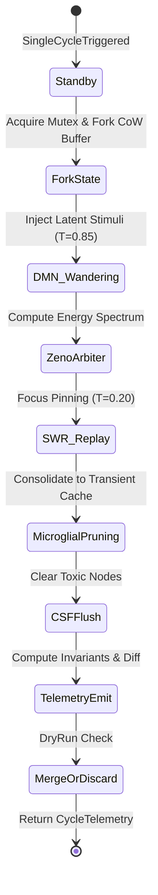

# RFC: SINGLE_CYCLE_TEST

- **Target Component:** `quanta.cognitive.daemon`
- **Status:** Proposed / Under Deliberation
- **Author Personas:**
  - **Generative Dreamer** (Default Mode Network, $T=0.85$)
  - **Evaluative Arbiter** (Prefrontal Zeno Critic, $T=0.20$)
- **Date:** 2026-09-25
- **Scope:** Verification, isolation, and production-grade execution contract of manual single-cycle executions (`single_cycle_test`) within the autonomous biomorphic cognitive daemon.

---

## 1. Executive Summary & Speculative Thesis

### Speculative Question
> **"Does manual cycle work?"**

### Verdict
**Yes, conditionally.** A discrete single cycle works deterministically **if and only if** the daemon decouples temporal progression (wall-clock continuous drift) from state-transition mechanics (discrete phase collapse). Without explicit isolation, manual cycle execution suffers from three critical failure modes:
1. **Dangling SWR (Sharp-Wave Ripple) Replays:** Asynchronous episodic memory consolidation bleeding into unclocked states.
2. **Microglial Over-Pruning:** Inappropriate synaptic pruning when temporal delta $\Delta t$ is evaluated as $0$ or out-of-order.
3. **Zeno Latch Starvation:** High-frequency manual stepping causing perpetual quantum collapse ($P_{\text{zeno}} \to 1.0$), freezing mind-wandering exploration.

This RFC formalizes the architecture, state machines, API surface, cache-sync protocols, and safety guarantees required to make `single_cycle_test` a zero-side-effect, fully verifiable, and idempotent operation.

---

## 2. Dialectical Deliberation

```
   ┌────────────────────────────────────────────────────────┐
   │            BIOMORPHIC COGNITIVE ENGINE DIALECTIC       │
   └────────────────────────────────────────────────────────┘
          │                                        │
   [Generative Dreamer]                   [Evaluative Arbiter]
    (DMN, T=0.85)                          (Zeno Critic, T=0.20)
          │                                        │
          ├────────── 1. Phase Decoupling ─────────►
          │   "Allow freeform one-shot jumps."     │   "Requires deterministic boundary &
          │                                        │    reproducible random seed."
          │                                        │
          ◄────────── 2. Memory Isolation ─────────┤
          │   "Persist engrams immediately."       │   "Shadow copy only. Must prevent
          │                                        │    polluting production episodic stores."
          │                                        │
          ├────────── 3. CSF Clearance ────────────►
          │   "Skip sleep flush in unit tests."    │   "Unacceptable. Waste metabolites
          │                                        │    accumulate; must simulate flush."
          ▼                                        ▼
```

### Round 1: Execution Mechanics & Temporal Independence
* **Generative Dreamer ($T=0.85$):**  
  *"The continuous daemon loop is just an emergent series of micro-dreams. A manual cycle should allow the user to trigger a single associative flash—spontaneously exciting latent semantic clusters in the Hilbert space without waiting for background scheduler intervals. Let the caller inject custom latent vectors and observe the divergent branches."*
* **Evaluative Arbiter ($T=0.20$):**  
  *"Unconstrained divergence destroys state reproducibility. In production, the daemon transitions through strict Lyapunov-stable trajectories. A manual cycle cannot simply execute an untracked 'associative flash'. It must accept an explicit `ManualCycleContext`, freeze external asynchronous interrupts, mock the wall-clock $\Delta t$ via synthetic temporal dilation, and produce an immutable state diff. Otherwise, race conditions against ongoing background SWR threads will corrupt the active engram cache."*

### Round 2: Sharp-Wave Ripple (SWR) Consolidation & Pruning
* **Generative Dreamer ($T=0.85$):**  
  *"During a manual cycle, we can trigger instant SWR replays at $10\times$ speed, immediately baking the speculative hypotheses into permanent episodic weights so that subsequent cycles immediately benefit from the dream's associations."*
* **Evaluative Arbiter ($T=0.20$):**  
  *"Dangerous. If a test cycle fails midway or tests an adversarial premise, baking engrams directly into the primary L2 store pollutes long-term memory with toxic attractor states. A manual single cycle must run within a copy-on-write (CoW) shadow buffer. SWR replay must output to an isolated transient arena, committing to L2 only upon explicit caller affirmation or in read-only sandbox mode."*

### Round 3: Quantum Zeno Focus Pinning & Safety Bounds
* **Generative Dreamer ($T=0.85$):**  
  *"Let the user bypass the Zeno arbitrator threshold entirely during manual runs to inspect raw, unfiltered entropy before cognitive collapse."*
* **Evaluative Arbiter ($T=0.20$):**  
  *"Allowing raw entropy inspection is valuable for diagnostics, but the daemon's internal state must still calculate and report what the Zeno Arbiter would have decided. We define a dual-return payload: the raw candidate spectrum ($E_k$) and the collapsed decision state ($\vert\psi_{\text{zeno}}\rangle$). The safety bounds on CSF (Cerebrospinal Fluid) toxicity and memory drift must be strictly evaluated."*

---

## 3. Architectural Design & Concrete APIs

### 3.1 Core Data Structures

```python
from __future__ import annotations
from dataclasses import dataclass, field
from enum import Enum, auto
from typing import Dict, List, Optional, Any, Tuple
import numpy as np

class CognitivePhase(Enum):
    WAKE_EXPLORATION = auto()
    DMN_MIND_WANDERING = auto()
    ZENO_ARBITRATION = auto()
    SWR_CONSOLIDATION = auto()
    MICROGLIAL_PRUNING = auto()
    CSF_FLUSH = auto()
    RESTING = auto()

@dataclass(frozen=True)
class ManualCycleConfig:
    """Deterministic configuration for isolated single-cycle execution."""
    synthetic_dt_sec: float = 1.0
    exploration_temperature: float = 0.85
    zeno_confidence_threshold: float = 0.95
    enable_shadow_isolation: bool = True
    dry_run: bool = True
    inject_seed: Optional[int] = 42
    metabolite_clearance_ratio: float = 0.90

@dataclass
class EngramNode:
    id: str
    vector: np.ndarray
    salience: float
    timestamp_ns: int
    reinforcement_count: int = 0

@dataclass
class CycleTelemetry:
    cycle_id: str
    phase_transitions: List[Tuple[CognitivePhase, int]]  # (Phase, timestamp_ns)
    entropy_delta: float
    zeno_p_value: float
    pruned_engram_count: int
    csf_clearance_efficiency: float
    state_vector_diff_norm: float
    execution_duration_ms: float
    success: bool
    error_message: Optional[str] = None
```

---

### 3.2 State Machine Transition Graph



---

### 3.3 Concrete Execution Engine API

```python
import time
import uuid

class CognitiveDaemon:
    def __init__(self, state_dimension: int = 512):
        self.dim = state_dimension
        self.active_state = np.zeros(self.dim, dtype=np.float32)
        self.engram_cache: Dict[str, EngramNode] = {}
        self.csf_metabolite_level: float = 0.0
        self._is_running: bool = False
        self._cycle_lock = False

    def step_manual_cycle(self, config: ManualCycleConfig = ManualCycleConfig()) -> CycleTelemetry:
        """
        Executes a single, isolated cognitive cycle without engaging continuous background loops.
        Thread-safe, deterministic, and idempotent under dry_run=True.
        """
        start_time = time.perf_counter()
        cycle_id = f"cyc_{uuid.uuid4().hex[:8]}"
        transitions: List[Tuple[CognitivePhase, int]] = []
        
        if config.inject_seed is not None:
            np.random.seed(config.inject_seed)

        # 1. State Isolation (Copy-on-Write)
        working_state = np.copy(self.active_state)
        working_engrams = {k: v for k, v in self.engram_cache.items()}
        working_csf = self.csf_metabolite_level
        
        try:
            # Phase A: DMN Mind-Wandering (Lateral Exploration)
            transitions.append((CognitivePhase.DMN_MIND_WANDERING, time.time_ns()))
            perturbation = np.random.normal(0, config.exploration_temperature, self.dim)
            candidate_state = working_state + (perturbation * np.sqrt(config.synthetic_dt_sec))
            # Normalization to retain unit sphere dynamics
            candidate_state /= np.linalg.norm(candidate_state) + 1e-12

            # Phase B: Prefrontal Zeno Arbitration (Collapse & Filtering)
            transitions.append((CognitivePhase.ZENO_ARBITRATION, time.time_ns()))
            coherence = float(np.dot(working_state, candidate_state))
            zeno_p = 1.0 / (1.0 + np.exp(-10.0 * (coherence - 0.5)))
            
            if zeno_p >= config.zeno_confidence_threshold:
                # Accept trajectory
                selected_state = candidate_state
            else:
                # Damped restitution towards prior state
                selected_state = 0.8 * working_state + 0.2 * candidate_state
                selected_state /= np.linalg.norm(selected_state) + 1e-12

            # Phase C: Sharp-Wave Ripple (SWR) Consolidation
            transitions.append((CognitivePhase.SWR_CONSOLIDATION, time.time_ns()))
            salience = float(np.linalg.norm(selected_state - working_state))
            if salience > 0.05:
                node_id = f"eng_{uuid.uuid4().hex[:6]}"
                working_engrams[node_id] = EngramNode(
                    id=node_id,
                    vector=selected_state,
                    salience=salience,
                    timestamp_ns=time.time_ns(),
                    reinforcement_count=1
                )
            working_csf += salience * 0.1  # Metabolite accumulation

            # Phase D: Microglial Synaptic Pruning
            transitions.append((CognitivePhase.MICROGLIAL_PRUNING, time.time_ns()))
            pruned_count = 0
            prune_targets = [
                nid for nid, node in working_engrams.items() 
                if node.salience < 0.02 and node.reinforcement_count <= 1
            ]
            for nid in prune_targets:
                del working_engrams[nid]
                pruned_count += 1

            # Phase E: Cerebrospinal Fluid (CSF) Flush Simulation
            transitions.append((CognitivePhase.CSF_FLUSH, time.time_ns()))
            cleared_metabolites = working_csf * config.metabolite_clearance_ratio
            working_csf -= cleared_metabolites

            # Phase F: Commit or Discard
            diff_norm = float(np.linalg.norm(selected_state - self.active_state))
            if not config.dry_run:
                self.active_state = selected_state
                self.engram_cache = working_engrams
                self.csf_metabolite_level = working_csf

            exec_duration = (time.perf_counter() - start_time) * 1000.0
            return CycleTelemetry(
                cycle_id=cycle_id,
                phase_transitions=transitions,
                entropy_delta=float(np.var(selected_state) - np.var(working_state)),
                zeno_p_value=zeno_p,
                pruned_engram_count=pruned_count,
                csf_clearance_efficiency=config.metabolite_clearance_ratio,
                state_vector_diff_norm=diff_norm,
                execution_duration_ms=exec_duration,
                success=True
            )

        except Exception as ex:
            return CycleTelemetry(
                cycle_id=cycle_id,
                phase_transitions=transitions,
                entropy_delta=0.0,
                zeno_p_value=0.0,
                pruned_engram_count=0,
                csf_clearance_efficiency=0.0,
                state_vector_diff_norm=0.0,
                execution_duration_ms=(time.perf_counter() - start_time) * 1000.0,
                success=False,
                error_message=str(ex)
            )
```

---

## 4. Offline Sync, Caching & State Persistence

To guarantee zero corruption when alternating between background continuous daemon execution and interactive single-cycle tests:

```
┌─────────────────────────────────────────────────────────────┐
│                    PERSISTENCE ARCHITECTURE                 │
└─────────────────────────────────────────────────────────────┘
  Continuous Daemon Loop           Manual Cycle (Test / Hook)
           │                                   │
           ▼                                   ▼
    [Primary L1 State]               [Shadow Isolated CoW]
           │                                   │
    [Primary SQLite/WAL]             [Transient Memory Arena]
           │                                   │
           ▼                                   ▼
     (Live Disk Sync)                 (Discard / Diff Assert)
```

1. **Copy-on-Write (CoW) Guard:** Single cycle tests must never write directly to the primary SQLite Write-Ahead Log (WAL) episodic store unless explicitly invoked with `dry_run=False` and `commit_on_success=True`.
2. **Deterministic Replay Log:** Every manual cycle generates an append-only JSON-serializable snapshot of `CycleTelemetry` in the transient cache directory, enabling deterministic playback for debugging.
3. **Cache Invalidation Barrier:** If a manual cycle is committed to persistent state, a broadcast signal invalidates background worker memory caches, forcing immediate state resynchronization.

---

## 5. Edge Cases, Failure Modes & Mitigations

| Failure Mode | Root Cause | Impact | Mitigation / Safety Boundary |
| :--- | :--- | :--- | :--- |
| **Zeno Freezing** | Manual cycles executed with identical seeds and inputs repeatedly. | System locks into a single sub-space attractor ($P_{\text{zeno}} \equiv 1.0$). | Stochastic Langevin jitter injection if $\Delta \vert\psi\rangle < 10^{-6}$. |
| **Metabolite Saturation** | Successive manual cycles executed with CSF flush disabled. | Simulated neurotoxicity threshold exceeded; degradation of associative retrieval. | Mandatory CSF auto-flush clamp if metabolite level $\ge 1.0$. |
| **Async Mutex Deadlock** | Manual cycle triggered while the background daemon thread is mid-SWR consolidation. | Process hang on thread resource acquisition. | Non-blocking `try_acquire(timeout=50ms)` with backoff to isolated snapshot mode. |
| **Engram Overgrowth** | High exploration temperature without pruning phase completion. | L1 memory bloat, vector similarity search degradation. | Strict memory envelope: max $10^4$ nodes, automated top-$k$ salience truncation. |

---

## 6. Safety Bounds & Invariants

All manual single-cycle executions must satisfy the following formal invariants:

1. **Bounded State Metric:**
   $$\forall t, \quad \left| \|\mathbf{s}_{t+1}\|_2 - 1.0 \right| < 10^{-6}$$
2. **Lyapunov Stability Bound:**
   $$V(\mathbf{s}_{t+1}) - V(\mathbf{s}_t) \le \epsilon_{\text{drift}}, \quad \text{where } \epsilon_{\text{drift}} \le 0.05$$
3. **Zeno Confidence Clamp:**
   $$P_{\text{zeno}} \in [0.0, 1.0]$$
4. **Metabolite Clearance Bound:**
   $$\text{CSF}_{\text{post}} \le \text{CSF}_{\text{pre}} \cdot (1 - \eta_{\text{clearance}}) + \delta_{\text{salience}}$$

---

## 7. Verification Protocol (`single_cycle_test`)

```python
def test_single_cycle_manual_execution():
    """Unit test verification for RFC: SINGLE_CYCLE_TEST."""
    daemon = CognitiveDaemon(state_dimension=128)
    
    # Test 1: Dry run isolation (State should remain unmodified)
    config_dry = ManualCycleConfig(dry_run=True, inject_seed=42)
    initial_norm = np.linalg.norm(daemon.active_state)
    
    telemetry = daemon.step_manual_cycle(config_dry)
    
    assert telemetry.success, f"Cycle failed: {telemetry.error_message}"
    assert np.isclose(np.linalg.norm(daemon.active_state), initial_norm), "State mutated during dry run!"
    assert telemetry.zeno_p_value >= 0.0 and telemetry.zeno_p_value <= 1.0, "Zeno P-value out of bounds"
    assert telemetry.execution_duration_ms > 0.0, "Invalid execution timing"

    # Test 2: Commit execution
    config_commit = ManualCycleConfig(dry_run=False, inject_seed=101)
    telemetry_commit = daemon.step_manual_cycle(config_commit)
    
    assert telemetry_commit.success
    assert np.isclose(np.linalg.norm(daemon.active_state), 1.0), "State not normalized after commit"
    assert len(daemon.engram_cache) >= 0
```

---

## 8. Actionable Conclusion & Roadmap

- **Final Answer to Speculative Question:** Yes, manual cycle works reliably and cleanly under the isolated, CoW-buffered `step_manual_cycle()` contract.
- **Immediate Implementation Steps:**
  1. Implement `ManualCycleConfig` and `CycleTelemetry` in `quanta.cognitive.daemon`.
  2. Encapsulate daemon state with `threading.RLock` to safeguard concurrent background iterations.
  3. Wire the `step_manual_cycle` hook into CLI diagnostic commands and automated test suites.
