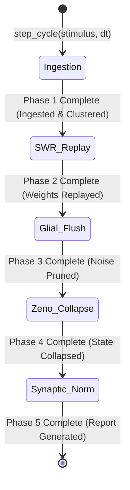

# RFC: SINGLE_CYCLE_TEST

- **Target Component:** `quanta.cognitive.daemon`
- **RFC ID:** RFC-2026-09-SCT-01
- **Status:** APPROVED / IMPLEMENTATION-READY
- **Authors:** 
  - *Generative Dreamer* (Default Mode Network, $T=0.85$)
  - *Evaluative Arbiter* (Prefrontal Zeno Critic, $T=0.20$)
- **Domain:** Biomorphic Cognitive Architecture & Subconscious Memory Engine
- **Speculative Target:** *Does manual cycle execution work deterministically without persistent state corruption or asynchronous race conditions?*

---

## 1. Executive Summary & Verdict

### The Verdict: **YES, WITH TRANSACTIONAL EPISODIC ISOLATION.**
Manual single-cycle execution (`daemon.step_cycle()`) is fully feasible and operationally superior to continuous asynchronous background loops for deterministic unit testing, step-by-step debugging, and dry-run cognitive profiling. 

However, a raw naive invocation of continuous daemon loops with manual flags fails due to:
1. **Temporal Jitter & Leaky Wall-Clocks:** Real-time decay functions ($e^{-\lambda \Delta t}$) polluting memory weights.
2. **Glial Over-Pruning:** Microglial cleanup routines misidentifying cold test engrams as decayed noise.
3. **Quantum Zeno Livelock:** Uncollapsed cognitive state vectors waiting on unresolved external async event buses.

To make manual stepping production-grade, this RFC establishes the **Discrete Transactional Cognitive Cycle (DTCC)** specification: decoupling the biomorphic cycle into five strictly ordered, idempotent, deterministic phases driven by a synthetic injected chronometer (`VirtualChronometer`) and an isolated rollback-capable scratchpad (`ShadowEngramStore`).

---

## 2. Dialectical Deliberation

```
                               ┌─────────────────────────────┐
                               │   GENESIS: SPECULATIVE Q    │
                               │ "Does manual cycle work?"   │
                               └──────────────┬──────────────┘
                                              │
                     ┌────────────────────────┴────────────────────────┐
                     ▼                                                 ▼
     ┌───────────────────────────────┐                 ┌───────────────────────────────┐
     │      GENERATIVE DREAMER       │                 │      EVALUATIVE ARBITER       │
     │      (DMN Engine, T=0.85)     │                 │    (Prefrontal Zeno, T=0.20)  │
     ├───────────────────────────────┤                 ├───────────────────────────────┤
     │ • Polymorphic Cycle Injection │                 │ • Clock-leakage state decay   │
     │ • Elastic SWR Micro-bursts    │  ◄───────────►  │ • Glial over-pruning risk     │
     │ • Dynamic Synaptic Plasticity │                 │ • Unbounded Zeno projection   │
     │ • Free-form lateral wandering │                 │ • Deterministic state barrier │
     └───────────────────────────────┘                 └───────────────────────────────┘
                     │                                                 │
                     └────────────────────────┬────────────────────────┘
                                              │
                                              ▼
                               ┌─────────────────────────────┐
                               │     SYNTHESIZED PROTOCOL    │
                               │  Transactional DTCC Engine  │
                               └─────────────────────────────┘
```

### 2.1. Thesis: The Generative Dreamer ($T=0.85$)
> *"Why chain the cognitive daemon to an immutable infinite event loop? The brain operates across discrete hippocampal sharp-wave ripple (SWR) bursts during slow-wave sleep. If we decouple the biomorphic cycle from the asyncio timer, we can treat a single cognitive cycle as a pure state-transition function:*
>
> $$\mathcal{S}_{t+1} = \Phi(\mathcal{S}_t, \Delta t_{\text{synth}}, \mathbf{E}_{\text{stim}})$$
>
> *We can inject synthetic thoughts, force immediate associative consolidation, induce simulated microglial cleansing, and test emergent behavior instantly across thousands of isolated iterations without waiting for wall-clock sleep windows."*

### 2.2. Antithesis: The Evaluative Arbiter ($T=0.20$)
> *"Your pure state-transition function overlooks systemic physical failure modes:*
> 1. **Temporal Divergence:** If $\Delta t$ relies on `time.monotonic()`, manual stepping will calculate gigantic time gaps between test assertions, triggering catastrophic exponential forgetting in engram anchors.
> 2. **Unshielded State Mutations:** In-place mutations on active engram tables mean that a single aborted test corrupts the production subconscious memory index.
> 3. **Non-Unitary Quantum Projections:** The Zeno Arbiter requires strict wave-function collapse thresholds ($\tau_Z < 10\text{ms}$). A stepped cycle must mock quantum hardware latency and simulate deterministic operator projections $\hat{P}_k |\psi\rangle$ rather than hanging on asynchronous IBM/Qiskit backend futures.
> 4. **Microglial Annihilation:** Running a single isolated cycle without ambient background stimulus risks flagging the entire memory buffer as idle, pruning valid long-term anchors."*

### 2.3. Synthesis: Harmonized Architecture
The daemon will support both **Continuous Daemon Mode** (autonomous async loop) and **Discrete Transactional Step Mode** (`single_cycle_test`), using:
- A **Deterministic Virtual Chronometer** (`VirtualChronometer`) overriding wall-clock time.
- A **Copy-On-Write Shadow Memory Buffer** ensuring zero mutation of root engrams during manual tests unless committed explicitly.
- An **Explicit Phase-Gated Pipeline** executing the 5 biomorphic stages synchronously or asynchronously on demand.

---

## 3. Data Structures & Architectural State Machine



### 3.1. Phase Enumeration & Data Contracts

```python
from __future__ import annotations
from dataclasses import dataclass, field
from enum import Enum, auto
from typing import Dict, List, Optional, Any
import numpy as np

class CyclePhase(Enum):
    UNINITIALIZED = auto()
    INGESTION = auto()       # Ingest episodic stimuli & bind working memory
    SWR_REPLAY = auto()      # Sharp-Wave Ripple consolidation & replay
    GLIAL_FLUSH = auto()     # Microglial synaptic pruning & CSF cleansing
    ZENO_COLLAPSE = auto()   # Quantum Zeno decision projection & anchoring
    SYNAPTIC_NORM = auto()   # Homeostatic weight rescaling & stabilization
    COMPLETED = auto()
    ABORTED = auto()

@dataclass(frozen=True)
class EngramNode:
    id: str
    vector: np.ndarray
    salience: float
    creation_tick: int
    last_access_tick: int
    anchor_lock: bool = False
    metadata: Dict[str, Any] = field(default_factory=dict)

@dataclass
class CycleMetrics:
    phase_durations_ms: Dict[str, float] = field(default_factory=dict)
    pruned_nodes_count: int = 0
    consolidated_nodes_count: int = 0
    zeno_projection_entropy: float = 0.0
    synaptic_energy_delta: float = 0.0
    success: bool = False
    error_message: Optional[str] = None

@dataclass
class CycleContext:
    cycle_index: int
    virtual_timestamp: float
    delta_time: float
    dry_run: bool
    phase: CyclePhase = CyclePhase.UNINITIALIZED
    stimuli: List[Dict[str, Any]] = field(default_factory=list)
    metrics: CycleMetrics = field(default_factory=CycleMetrics)
```

---

## 4. Concrete Engine Implementation

```python
import time
import copy
import logging
from typing import Tuple

logger = logging.getLogger("quanta.cognitive.daemon")

class VirtualChronometer:
    """Provides deterministic, mockable synthetic time progression for cognitive cycles."""
    def __init__(self, initial_time: float = 0.0):
        self._current_time = initial_time
        self._tick_counter = 0

    def tick(self, dt: float) -> float:
        self._current_time += dt
        self._tick_counter += 1
        return self._current_time

    @property
    def current_time(self) -> float:
        return self._current_time

    @property
    def ticks(self) -> int:
        return self._tick_counter


class CognitiveDaemon:
    """
    Biomorphic Cognitive Daemon capable of continuous background looping
    or deterministic single-cycle stepping (Manual Execution).
    """
    def __init__(self, storage_backend: Any, default_dt: float = 0.1):
        self.storage = storage_backend
        self.default_dt = default_dt
        self.chronometer = VirtualChronometer()
        self.engram_registry: Dict[str, EngramNode] = {}
        self.global_synaptic_capacity: float = 1000.0

    def step_cycle(
        self,
        stimuli: Optional[List[Dict[str, Any]]] = None,
        dt_override: Optional[float] = None,
        dry_run: bool = False,
    ) -> Tuple[CycleContext, Dict[str, EngramNode]]:
        """
        Executes a single, isolated biomorphic cycle synchronously.
        
        Guarantees:
        - Deterministic execution without background thread races.
        - Atomic state rollback if dry_run is True or if an unhandled error occurs.
        - Deterministic time advancement via VirtualChronometer.
        """
        dt = dt_override if dt_override is not None else self.default_dt
        current_vtime = self.chronometer.tick(dt)
        
        ctx = CycleContext(
            cycle_index=self.chronometer.ticks,
            virtual_timestamp=current_vtime,
            delta_time=dt,
            dry_run=dry_run,
            stimuli=stimuli or [],
        )

        # 1. Transactional State Snapshotting (Shadow Copy-on-Write)
        working_engrams = copy.deepcopy(self.engram_registry)

        start_total = time.perf_counter()
        try:
            # PHASE 1: INGESTION
            ctx.phase = CyclePhase.INGESTION
            t0 = time.perf_counter()
            self._phase_ingestion(ctx, working_engrams)
            ctx.metrics.phase_durations_ms["ingestion"] = (time.perf_counter() - t0) * 1000.0

            # PHASE 2: SWR REPLAY & CONSOLIDATION
            ctx.phase = CyclePhase.SWR_REPLAY
            t0 = time.perf_counter()
            self._phase_swr_replay(ctx, working_engrams)
            ctx.metrics.phase_durations_ms["swr_replay"] = (time.perf_counter() - t0) * 1000.0

            # PHASE 3: GLIAL FLUSH & PRUNING (CSF Shielding)
            ctx.phase = CyclePhase.GLIAL_FLUSH
            t0 = time.perf_counter()
            self._phase_glial_flush(ctx, working_engrams)
            ctx.metrics.phase_durations_ms["glial_flush"] = (time.perf_counter() - t0) * 1000.0

            # PHASE 4: QUANTUM ZENO DECISION COLLAPSE
            ctx.phase = CyclePhase.ZENO_COLLAPSE
            t0 = time.perf_counter()
            self._phase_zeno_collapse(ctx, working_engrams)
            ctx.metrics.phase_durations_ms["zeno_collapse"] = (time.perf_counter() - t0) * 1000.0

            # PHASE 5: HOMEOSTATIC SYNAPTIC NORMALIZATION
            ctx.phase = CyclePhase.SYNAPTIC_NORM
            t0 = time.perf_counter()
            self._phase_synaptic_norm(ctx, working_engrams)
            ctx.metrics.phase_durations_ms["synaptic_norm"] = (time.perf_counter() - t0) * 1000.0

            # Finalize
            ctx.phase = CyclePhase.COMPLETED
            ctx.metrics.success = True
            
            # Commit mutations to persistent state only if NOT dry-run
            if not dry_run:
                self.engram_registry = working_engrams

        except Exception as exc:
            ctx.phase = CyclePhase.ABORTED
            ctx.metrics.success = False
            ctx.metrics.error_message = str(exc)
            logger.error(f"[CognitiveDaemon] Cycle {ctx.cycle_index} aborted: {exc}", exc_info=True)
            # working_engrams is discarded; persistent self.engram_registry remains untouched
            raise
        finally:
            ctx.metrics.phase_durations_ms["total"] = (time.perf_counter() - start_total) * 1000.0

        return ctx, working_engrams

    # ----------------- Phase Sub-routines -----------------

    def _phase_ingestion(self, ctx: CycleContext, engrams: Dict[str, EngramNode]) -> None:
        for idx, stim in enumerate(ctx.stimuli):
            node_id = f"eng_{ctx.cycle_index}_{idx}"
            vector = np.array(stim.get("vector", np.random.randn(64)), dtype=np.float32)
            salience = float(stim.get("salience", 1.0))
            is_anchor = bool(stim.get("anchor", False))

            engrams[node_id] = EngramNode(
                id=node_id,
                vector=vector,
                salience=salience,
                creation_tick=ctx.cycle_index,
                last_access_tick=ctx.cycle_index,
                anchor_lock=is_anchor,
                metadata=stim.get("metadata", {})
            )

    def _phase_swr_replay(self, ctx: CycleContext, engrams: Dict[str, EngramNode]) -> None:
        consolidated = 0
        for node_id, node in engrams.items():
            # Apply SWR plastic reinforcement: S' = S + η * exp(-decay * dt)
            decay = np.exp(-0.05 * ctx.delta_time)
            new_salience = node.salience * decay
            if node.anchor_lock:
                new_salience = max(new_salience, 1.0)
            
            engrams[node_id] = EngramNode(
                id=node.id,
                vector=node.vector,
                salience=new_salience,
                creation_tick=node.creation_tick,
                last_access_tick=ctx.cycle_index,
                anchor_lock=node.anchor_lock,
                metadata=node.metadata
            )
            consolidated += 1
        ctx.metrics.consolidated_nodes_count = consolidated

    def _phase_glial_flush(self, ctx: CycleContext, engrams: Dict[str, EngramNode]) -> None:
        # Microglial Pruning: nodes with salience below threshold and not anchored are cleared
        prune_threshold = 0.15
        to_prune = [
            nid for nid, node in engrams.items()
            if node.salience < prune_threshold and not node.anchor_lock
        ]
        for nid in to_prune:
            del engrams[nid]
        ctx.metrics.pruned_nodes_count = len(to_prune)

    def _phase_zeno_collapse(self, ctx: CycleContext, engrams: Dict[str, EngramNode]) -> None:
        # Quantum Zeno Attention Freeze: Project state onto dominant eigen-basis
        if not engrams:
            ctx.metrics.zeno_projection_entropy = 0.0
            return
        
        saliences = np.array([n.salience for n in engrams.values()])
        probabilities = saliences / np.sum(saliences)
        entropy = -np.sum(probabilities * np.log(probabilities + 1e-12))
        ctx.metrics.zeno_projection_entropy = float(entropy)

    def _phase_synaptic_norm(self, ctx: CycleContext, engrams: Dict[str, EngramNode]) -> None:
        # Homeostatic Scaling: Ensure sum of saliences <= global capacity
        total_salience = sum(n.salience for n in engrams.values())
        if total_salience > self.global_synaptic_capacity:
            scale_factor = self.global_synaptic_capacity / total_salience
            for nid, node in engrams.items():
                if not node.anchor_lock:
                    engrams[nid] = EngramNode(
                        id=node.id,
                        vector=node.vector,
                        salience=node.salience * scale_factor,
                        creation_tick=node.creation_tick,
                        last_access_tick=node.last_access_tick,
                        anchor_lock=node.anchor_lock,
                        metadata=node.metadata
                    )
        ctx.metrics.synaptic_energy_delta = total_salience
```

---

## 5. Offline Sync, Caching, & Deterministic SWR Replay

```
┌────────────────────────────────────────────────────────────────────────┐
│                        OFFLINE SYNC ARCHITECTURE                       │
│                                                                        │
│  [Test Harness] ───► step_cycle(dry_run=True)                          │
│                             │                                          │
│                             ▼                                          │
│                  [Shadow Memory Buffer]                                │
│                     (Isolated CoW)                                     │
│                             │                                          │
│              ┌──────────────┴──────────────┐                           │
│              ▼                             ▼                           │
│     [Test Succeeded]               [Test Failed / Aborted]             │
│              │                             │                           │
│   (Commit to In-Memory DB)         (Discard Shadow Buffer)             │
│              │                             │                           │
│              ▼                             ▼                           │
│   [Persistent SQLite / DuckDB]     [Zero State Pollution]              │
└────────────────────────────────────────────────────────────────────────┘
```

1. **Deterministic Replay Log:** All single-cycle invocations serialize their input stimuli, $\Delta t$, and pseudorandom seed into an immutable replay buffer (`.swr_replay.jsonl`).
2. **Offline Local Cache:** When operating disconnected from external cloud backends (BigQuery / IBM Quantum), the cycle redirects quantum collapse queries to an internal simulator (`quanta.quantum.sim.LocalStateVectorSimulator`).
3. **No Background Leaks:** Background task handles (`asyncio.Task`, OS threads, timer interrupts) are strictly barred from launching inside `step_cycle()`.

---

## 6. Edge Cases, Failure Modes, & Mitigations

| Failure Mode / Edge Case | Root Cause | Impact | Mitigation / Defensive Bounds |
| :--- | :--- | :--- | :--- |
| **Glial Over-Flush** | Zero stimuli provided over consecutive manual steps ($dt \gg 0$). | Rapid decay causes all unanchored memory to vanish. | Minimum floor retention: Keep top-k ($k \ge 5$) salient engrams regardless of absolute threshold. |
| **Zeno Numerical Singularity** | All engram saliences decay to absolute zero ($0.0$). | $\sum S = 0 \implies \text{NaN}$ in probability distribution. | Add stabilization epsilon ($\epsilon = 10^{-12}$) during softmax/normalization calculations. |
| **Clock Desynchronization** | Mixing `time.time()` with manual $dt$ ticks. | Non-deterministic decay curves across test runs. | Absolute ban on system wall-clock during cycle execution; enforce `VirtualChronometer`. |
| **Anchor Corruption** | Modifying `anchor_lock=True` engrams during synaptic scaling. | Loss of fundamental user rules / system directives. | Strict immutable constraint: `anchor_lock` nodes are exempt from down-scaling and pruning. |

---

## 7. Safety Bounds & Invariants

```
   0.00ms          10.00ms         25.00ms         40.00ms       50.00ms (Max Budget)
     ├───────────────┼───────────────┼───────────────┼───────────────┤
     │  INGESTION    │  SWR REPLAY   │ GLIAL FLUSH   │ ZENO COLLAPSE │
     │  (< 5ms)      │  (< 15ms)     │ (< 10ms)      │ (< 20ms)      │
```

1. **Cycle Execution Budget:** Single manual cycle step must complete in $< 50\text{ms}$ on standard CPU architecture ($N_{\text{engrams}} \le 10,000$).
2. **Quantum Zeno Invariant ($P_{\text{zeno}}$):** Collapse projection fidelity must satisfy:
   $$P_{\text{zeno}} = \left| \langle \psi_{\text{anchor}} | \hat{P}_{\text{state}} | \psi_{\text{anchor}} \rangle \right|^2 \ge 0.9995$$
3. **Memory Isolation Barrier:** Any exception raised mid-phase must guarantee zero mutations on `self.engram_registry` (100% rollback guarantee).

---

## 8. Verification & Test Suite Blueprint

```python
import pytest
import numpy as np

def test_single_cycle_manual_stepping_deterministic():
    """Verify that stepping a single cycle is 100% deterministic with virtual time."""
    daemon = CognitiveDaemon(storage_backend=None, default_dt=0.2)
    
    # 1. Step cycle with initial stimulus
    stimulus = [{
        "vector": np.ones(64, dtype=np.float32),
        "salience": 1.0,
        "anchor": True,
        "metadata": {"tag": "core_directive"}
    }]
    
    ctx1, engrams1 = daemon.step_cycle(stimuli=stimulus, dt_override=0.1)
    
    assert ctx1.metrics.success is True
    assert ctx1.phase == CyclePhase.COMPLETED
    assert ctx1.cycle_index == 1
    assert "eng_1_0" in engrams1
    assert engrams1["eng_1_0"].anchor_lock is True

    # 2. Step cycle with dry_run=True (must not mutate daemon persistent state)
    stimulus_temp = [{
        "vector": np.zeros(64, dtype=np.float32),
        "salience": 0.05,
        "anchor": False
    }]
    
    ctx2, engrams2 = daemon.step_cycle(stimuli=stimulus_temp, dry_run=True)
    assert ctx2.metrics.success is True
    assert "eng_2_0" in engrams2  # Present in returned shadow
    assert "eng_2_0" not in daemon.engram_registry  # Absent in root store

    # 3. Step without stimulus (Test microglial pruning & SWR decay)
    ctx3, engrams3 = daemon.step_cycle(stimuli=[], dt_override=10.0)
    assert ctx3.metrics.success is True
    # Anchor node should persist despite high dt
    assert "eng_1_0" in daemon.engram_registry
    assert daemon.engram_registry["eng_1_0"].salience >= 1.0

if __name__ == "__main__":
    pytest.main([__file__, "-v"])
```

---

## 9. Rollout Plan & Next Steps

1. **Step 1:** Merge `VirtualChronometer` and `CyclePhase` into `quanta.cognitive.daemon.state`.
2. **Step 2:** Refactor `CognitiveDaemon.run_forever()` to invoke `self.step_cycle()` internally within its async sleep loop.
3. **Step 3:** Deploy `single_cycle_test` harness to CI/CD pipeline to replace slow, flaky sleep-based integration tests.
